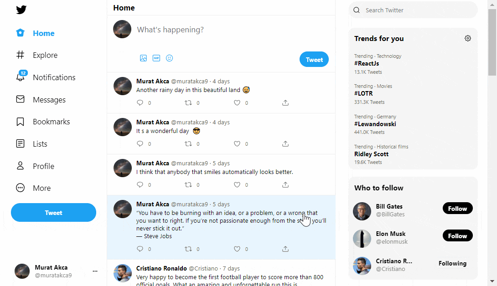

## Twitter Clone
This is a Full Stack example app (NextJs and MongoDB), that I created for training purposes. It is a clone of Twitter. During development phase I also tried to get feedback of components with Storybook tool.

## Demo
https://twitter-proj.vercel.app

## Features of the web application
- theme options ( light, dim, dark )
- responsive design
- partial server side rendering
- twitter functions like; follow, unfollow, post tweet

## Screenshots

## Structure

##### Front End - React, NextJs
I used React and NextJs to build the client side of the Application. NextJs is a practical React Framework with its ready to use Routing and API system.

##### Server Tier - NextJs
I used NextJs default API system for the backend. Its like express.js, but you dont need to strugle with routing. Folder structure handles that.

##### Database Tier - MongoDB
The data for the application such as user info, tweet info and trends is stored in MongoDB.

## Library, frameworks, tools etc. used

- [MongoDB](https://www.mongodb.com/)
- [React](https://reactjs.org/)
- [Axios](https://axios-http.com/)
- [NextJs](https://nextjs.org/)
- [Storybook](https://storybook.js.org/)

## Contribute
I will be happy to see your contributions.